# Spotify To YTMusic converter

## DISCLAIMER: current project will not work without inserting your own client_id and client_secret into assets/config.py

The project is an implementation of the Spotify to YTMusic playlist/song converter. App could transfer your 
playlists/songs with easy and no need in manually searching for each song.

# Table of Contents

- [Installation](#installation)
- [Requirements](#requirements)
- [Usage](#usage)
- [Testing](#testing)
- [Configuration](#configuration)
- [Authors and Contributors](#authors-and-contributors)

## Installation

To install this project, simply download the files and place them in the desired directory on your local machine.

## Requirements

- Python 3.1 or higher

This project requires the following libraries to be installed:

- requests
- Pillow
- flask
- [ytmusicapi](https://ytmusicapi.readthedocs.io/en/stable/)
- [customtkinter](https://github.com/TomSchimansky/CustomTkinter)

Use the package manager [pip](https://pip.pypa.io/en/stable/) to install necessary libraries.
```bash
pip install -r requirements.txt
```

## Usage

#### Please note that client_id and client_secret are sensitive information and should not be stored publically like this.
#### In order to use this app openly, go to [spotify dashboard](https://developer.spotify.com/dashboard) and get your own credentials

1. Clone or download this repository to your local machine.
2. Run the main script using the following command in your terminal:
```bash
python -m src
```

3. After installing requiring packages the browser will open with 2 new tabs ( Spotify and Google authentication pages).
The terminal should look like this:
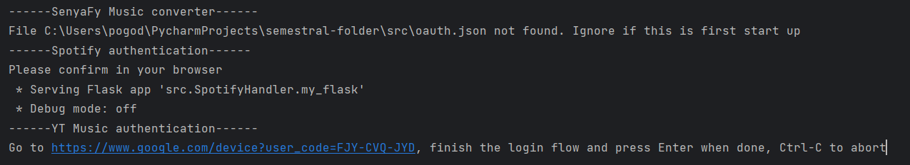
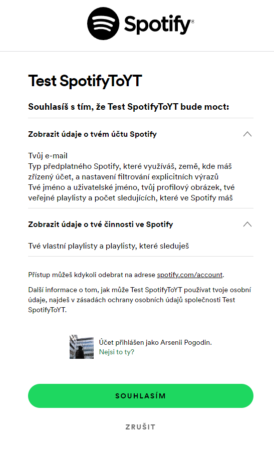
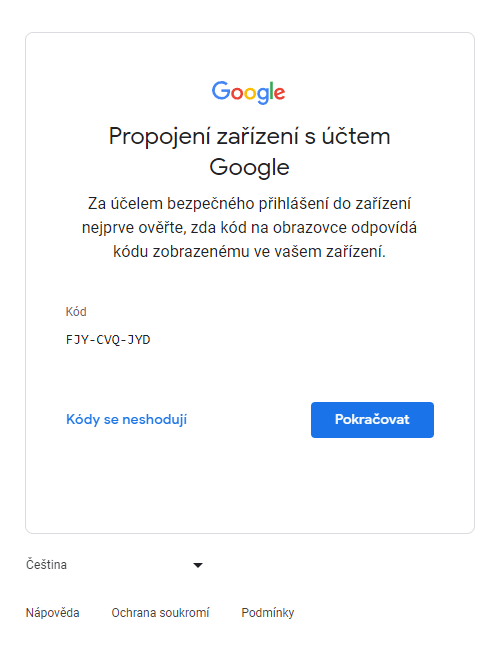

After logging in your spotify account you should see this page:

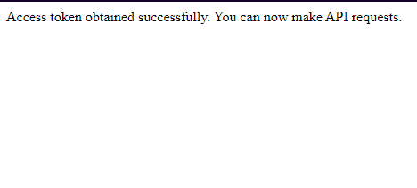

After logging in your google account you should press 'enter' key in your terminal. Your terminal should look like this.
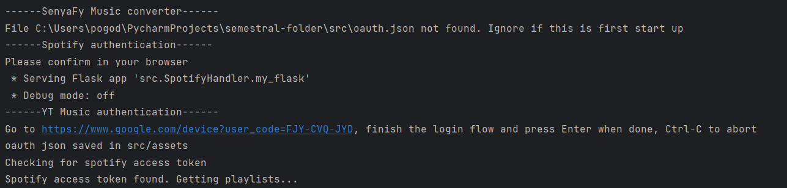

4. App interface
- Now you should be able to use application. You will see home page and navigation bar on the left side. You can change
white/dark version of the app. 
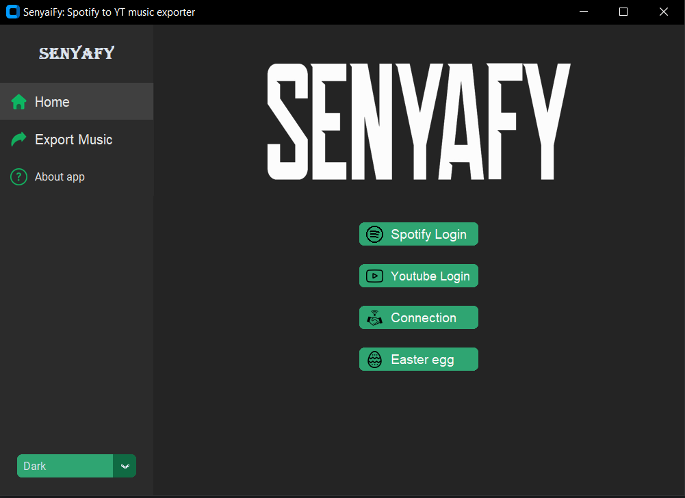
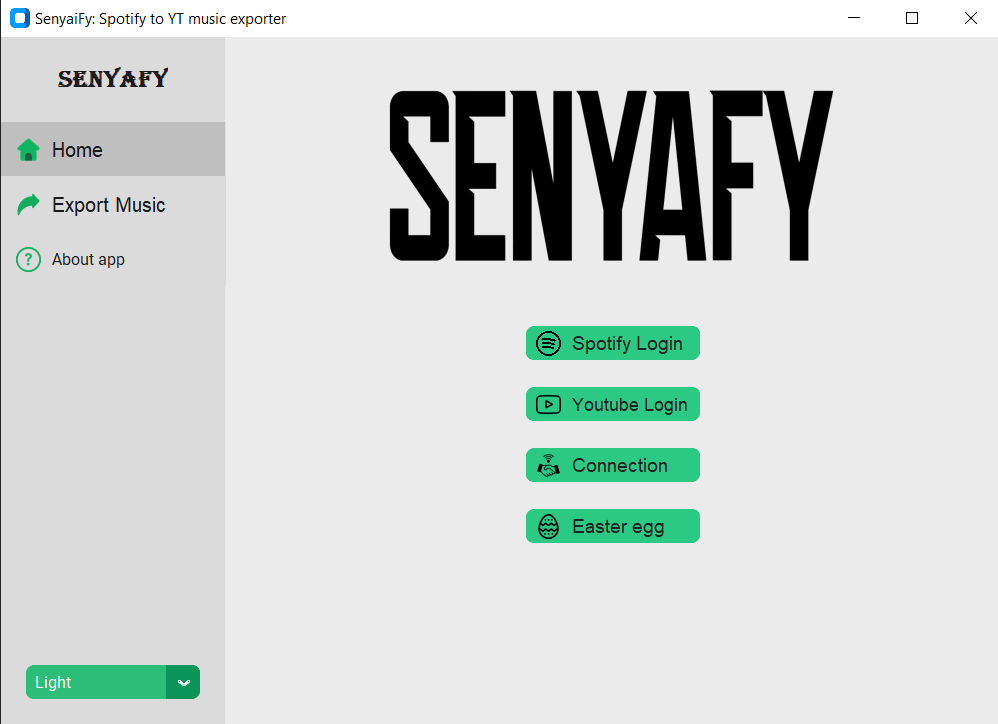

5. Home page consists of manually logging in Spotify/YT music if something fails. It will restart the process of authentication.

- Connection button test Spotify and Youtube Music connection be sending a test request. It will notify you by opening another window.
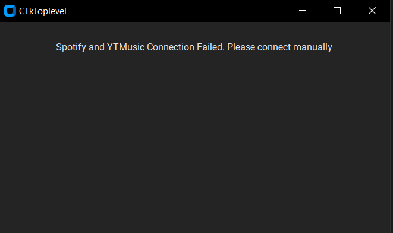

6. Export frame
  - After successfully connection with spotify you should be able to see yours Spotify playlists. After choosing playlist
    application will load songs in chosen playlist.
  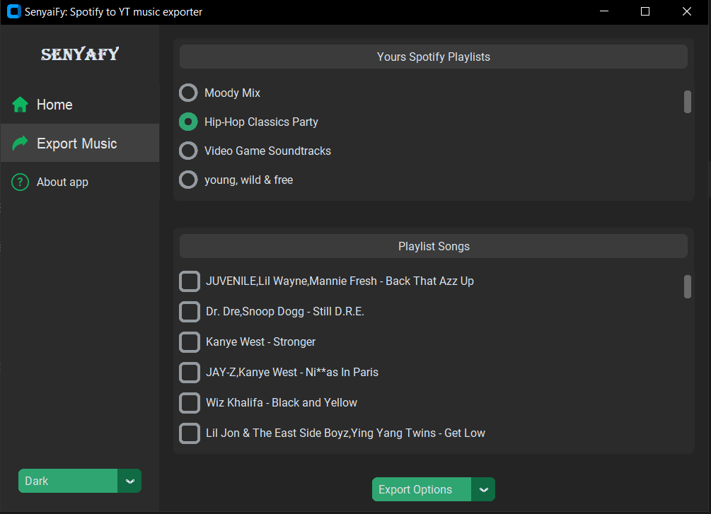
  - In the bottom you can choose between different option of exporting.
  
  - 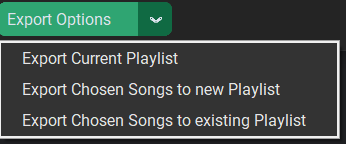
      1. Export all songs from current chosen playlist - It will create a new playlist and transfer each song to this playlist.
      In case playlist with this name exists and will add to it.
      2. Export chosen songs to new playlist - You can choose songs individually, create a new playlist 
      and transfer them to it. 

      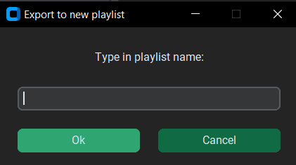
    
      3. Export chosen songs to existing playlist - You can choose songs individually and transfer them to an existing playlist.
      Note that it can transfer only to your own playlist. Unfortunately app does not support transferring songs to 
      'Like Music' playlist.

      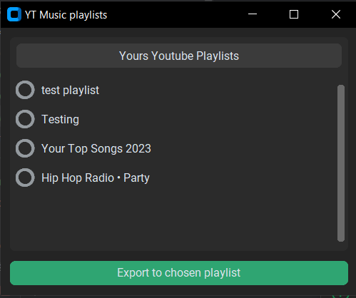

7. After exporting
   - After choosing playlist/songs to export and pressing the button you should see transfer process in the terminal.

    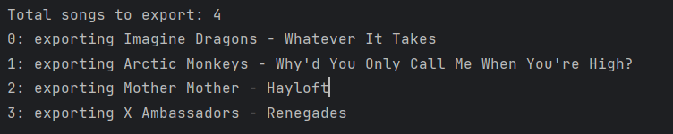

   - After finishing it will notify you about transfer status

   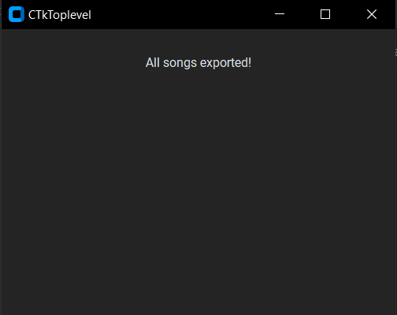
   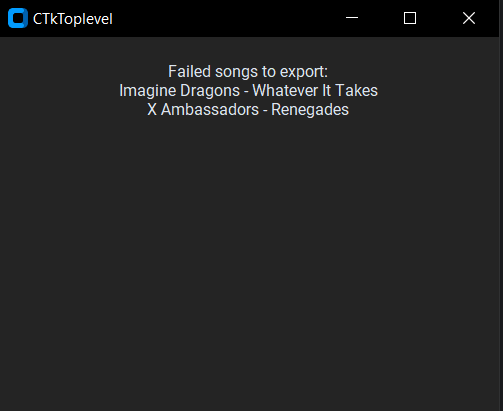


## Testing

Run tests by executing the following command:
```bash
pytest test_functions.py 
```
This command will launch tests.

## Configuration

Pull requests are welcome. For major changes, please open an issue first
to discuss what you would like to change.

Please make sure to update tests as appropriate.

## Authors and Contributors

Special thanks for Tom Schimansky and his [customtkinter](https://github.com/TomSchimansky/CustomTkinter) library
and for easy [ytmusicapi](https://ytmusicapi.readthedocs.io/en/stable/) library.
